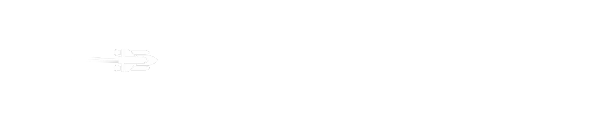
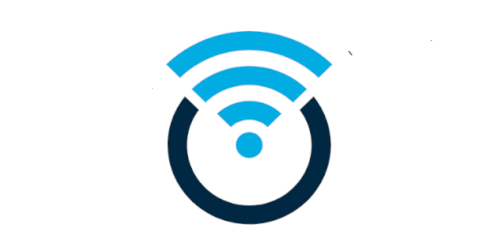
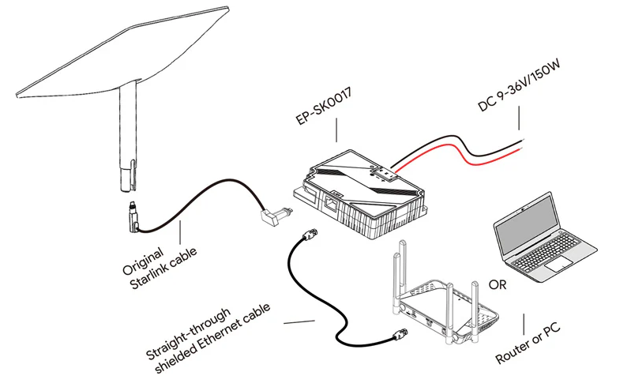
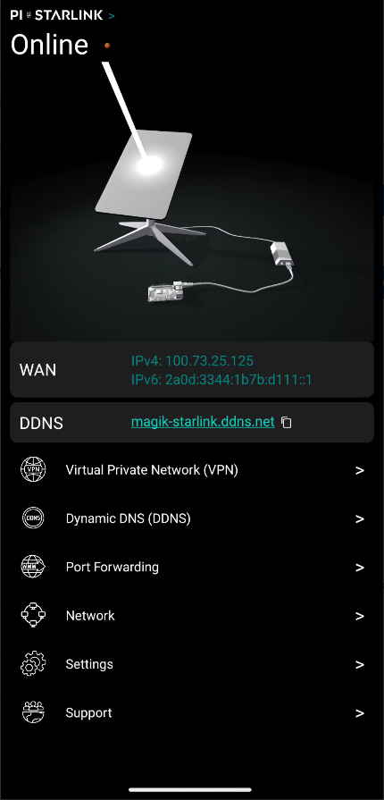
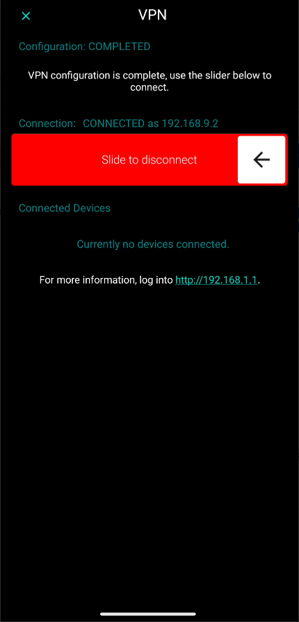
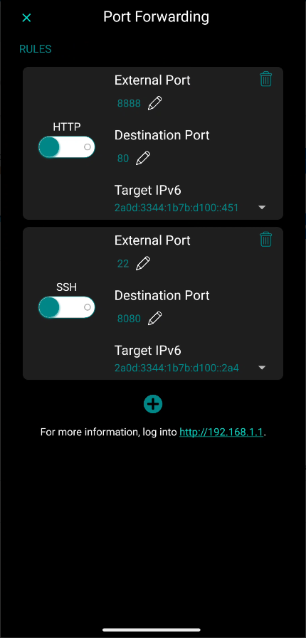
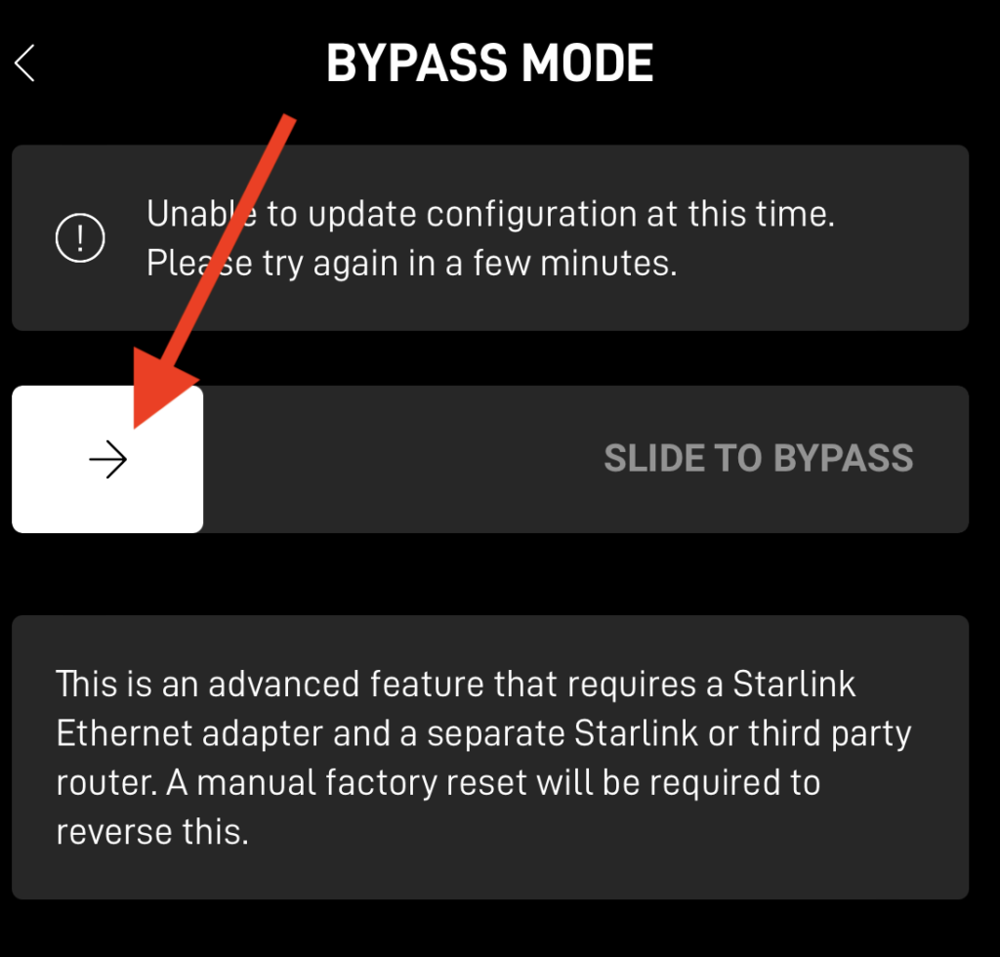
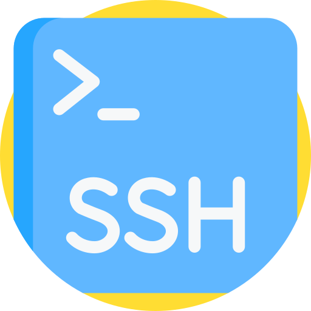

<!-- Improved compatibility of back to top link: See: https://github.com/othneildrew/Best-README-Template/pull/73 -->
<a id="readme-top"></a>
<!--
*** Thanks for checking out the Best-README-Template. If you have a suggestion
*** that would make this better, please fork the repo and create a pull request
*** or simply open an issue with the tag "enhancement".
*** Don't forget to give the project a star!
*** Thanks again! Now go create something AMAZING! :D
-->

<!-- PROJECT SHIELDS -->
<!--
*** I'm using markdown "reference style" links for readability.
*** Reference links are enclosed in brackets [ ] instead of parentheses ( ).
*** See the bottom of this document for the declaration of the reference variables
*** for contributors-url, forks-url, etc. This is an optional, concise syntax you may use.
*** https://www.markdownguide.org/basic-syntax/#reference-style-links
-->

<!-- PROJECT LOGO -->
<br />
<div align="center">
  <a href="https://github.com/github_username/repo_name">
    
  </a>

<h3 align="center">The Rasberry Pi's unofficial solution for Starlink.</h3>

  <p align="center">
    <br />
    <a href="https://github.com/davixdedem/Pi-Starlink/issues/">View Issues</a>
    ·
    <a href="https://github.com/davixdedem/Pi-Starlink/issues/new?labels=bug&template=bug-report---.md">Report Bug</a>
    ·
    <a href="https://github.com/davixdedem/Pi-Starlink/issues/new?labels=enhancement&template=feature-request---.md">Request Feature</a>
  </p>
</div>


<!-- TABLE OF CONTENTS -->
<details>
  <summary>Table of Contents</summary>
  <ol>
    <li>
      <a href="#whats-pi-starlink">What's Pi Starlink</a>
      <ul>
        <li><a href="#screenshots">Screenshots</a></li>
      </ul>
    </li>
    <li>
      <a href="#getting-started">Getting Started</a>
      <ul>
        <li><a href="#prerequisites">Prerequisites</a></li>
        <li><a href="#installation">Installation</a></li>
      </ul>
    </li>
    <li>
      <a href="#getting-started">Usage</a>
      <ul>
        <li><a href="#reach-your-home-from-outside-set-up-your-own-vpn">Reach your home from outside: set up your own VPN!</a></li>
        <li><a href="#get-rid-of-dynamic-ip-set-up-your-personal-ddns">Get rid of dynamic IP: set up your personal DDNS!</a></li>
        <li><a href="#got-a-game-server-or-a-web-page-set-up-port-forwarding">Got a Game Server or a Web Page? Set up Port Forwarding!</a></li>
        <li><a href="#need-to-go-deeper-ssh-into-your-pi-starlink">Need to go deeper, SSH into your Pi Starlink!</a></li>
        <li><a href="#in-need-of-more-ethernet-ports-get-an-extender">In need of more ethernet ports? Get an extender!</a></li> 
      </ul>
    </li>    
    <li><a href="#faq">FAQ</a></li>
    <li><a href="#roadmap">Roadmap</a></li>
    <li><a href="#contributing">Contributing</a></li>
    <li><a href="#privacy-policy">Privacy Policy</a></li>
    <li><a href="#contact">Contact</a></li>
  </ol>
</details>


<!-- ABOUT THE PROJECT -->
## What's Pi Starlink?

<div align="center">
  <a href="https://play.google.com/store/apps/details?id=com.magix.pistarlink" target="_blank">
    
  </a>
</div>
<p align="center">
<a href="https://play.google.com/store/apps/details?id=com.magix.pistarlink" target="_blank">
  
</a>
<!---->
</p>  

<div align="center">
  <a href="https://drive.google.com/drive/folders/1pREPO48vvCrU5cWm2z4bHnBf_eGFIXJ8?usp=drive_link" target="_blank">
    
    <p align="center">
      
    </p>
  </a>
</div>

Since Starlink provides their clients a public <i>IPv6</i>, which is globally accessible, we leveraged on it building from scratch a custom image of <b>OpenWRT</b> dedicated to Raspberry Pi. 
This offers a proper and reliable Modem/Router with pre-configured settings studiously assessed for working with the Starlink Dish as plug & play. <br>

<div align="center">
  <i><b>Get now our Android app...</b></i>
</div>
<br>

The mobile application of <b>Pi Starlink</b> will allow you to set up your own free VPN all over IPv6 in a few easy steps and reach your home network while ensuring adequate security you need to surf the net safely. 
The VPN is based on <i>OpenVPN</i>, which is free and also, it works with the APIs provided by the fork project of <a href="https://github.com/schwabe/ics-openvpn"><i>OpenVPN for Android</i></a>. Pi Starlink is not only oriented to the normal Starlink customers but even to people who want 
to host their own public server globally as our application has specific features for managing <b>port forwarding</b> rules. In case you get an ethernet port extender, we’ll be able to set up a proper <b>DMZ</b>, all is up to you!<br>

<div align="center">
  <i><b>...IPv6, what a Saviour!</b></i>
</div>
<br>

An IPv6 address is certainly not easy to remember because of its length, that’s why our application points you in a good direction for you in order to set up a free Dynamic DNS, getting a fully qualified domain name to share with
people to you want to reach your game server, or your web page! We tried to raise an application that is far from complex, but feel free to open an issue if you encounter any problem.<br>

<div align="center">
  <i><b>Just in case you get a Power Over Ethernet!</b></i>
</div>
<br>
<div align="center">
  <a href="https://github.com/github_username/repo_name">
    
  </a>
</div>

One of the main goals of this project is power saving, because Pi Starlink replaced the original Starlink router, which has a higher power consumption compared to the low cost <b>Single Board Computer</b> we’re working on. 
As a matter of fact, most of the Starlink vanlifer users might be interested in this project as the power is a critical point they used to facing every day when they travel, and that’s now something very reachable. 
Just buy the PoE(Power over Ethernet) which powers up all your items from 12v switching to 46v avoiding any A.C inverter.<br>

<p align="right">(<a href="#readme-top">back to top</a>)</p>


<!-- USAGE -->
## Screenshots

<div align="center">
    
    
    
</div>

<p align="right">(<a href="#readme-top">back to top</a>)</p>

<!-- GETTING STARTED -->
## Getting Started
This project aims to replace the original Starlink router by utilizing a built-in feature of the Starlink app. To enable <b>bypass mode</b>, follow these steps:<br>
1. Open the Starlink app and navigate to the Settings section.<br>
2. Select the Router options.<br>
3. Toggle the <b>Bypass Starlink Router</b> switch.<br>
<div align="left">
  <a href="https://github.com/github_username/repo_name">
    
  </a>
</div>

## Installation
Unless you’re a developer, you’re not obliged to clone this repository so just download the pre configured OpenWRT image we provide you and flash it into your <b>Raspberry Pi</b>.<br>
<div align="left">
  <a href="https://github.com/github_username/repo_name">
    
  </a>
</div>

1. Download our pre-configured OpenWRT image from <a href="https://github.com/schwabe/ics-openvpn">Google Drive</a>.<br>
3. Flash it into a 32GB micro SDCard.<br>
4. Plug it into your Raspberry Pi.<br>
5. Power it up!<br><br>

<div align="left">
  <a href="https://github.com/github_username/repo_name">
    
  </a>
</div>

1. Download the Pi-Starlink application from the <a href="https://github.com/schwabe/ics-openvpn">Play Store</a>.<br>
2. Install it on your Smartphone.<br>
3. Connect it to the <b>Pi Starlink</b> Wi-Fi using the following default credentials:<br>
  ```sh
  SSID: Pi-Starlink
  Password: pistarlink
  ```
4. Open the app, you're in!<br>

<p align="right">(<a href="#readme-top">back to top</a>)</p>

## Prerequisites
### Minimum Requirements for your Smartphone.
- Operating System: Android 14 (API Level 34)<br>
- Processor: ARMv8 or equivalent<br>
- RAM: 4 GB or more<br>
- Storage: 100 MB of free space (for app installation and data)<br>
- Screen Resolution: HD (720p) or higher<br>
- Network: Wi-Fi or Mobile Data<br>

### Minimum Requirements for your Raspberry Pi.
- Raspberry Pi 3 Model B+
  - Wi-Fi: 802.11n
  - Ethernet: 10/100 Mbps

- Raspberry Pi 4 Model B
  - Wi-Fi: 802.11ac
  - Ethernet: Gigabit Ethernet

- Raspberry Pi 400
  - Wi-Fi: 802.11ac
  - Ethernet: Gigabit Ethernet

- Raspberry Pi 3 Model B
  - Wi-Fi: 802.11n
  - Ethernet: 10/100 Mbps

#### Recommended Model
- <b>Raspberry Pi 5</b>
  - Wi-Fi: 802.11ac or newer
  - Ethernet: Gigabit Ethernet

<p align="right">(<a href="#readme-top">back to top</a>)</p>

<!-- VPN setting -->
## Reach your home from outside: set up your own VPN!
<div align="center">
    
</div>
1. First of all, be sure you've already installed <a href="https://github.com/schwabe/ics-openvpn"><i>OpenVPN for Android</i></a> on your Smartphone.<br>
2. In Pi Starlink, go to the <i><b>Virtual Private Network(VPN)</b></i> section.<br>
3. Slide the configuration button, Pi Starlink will take a few minutes to configure OpenVPN depending on your Raspberry Pi efficiency.<br>
4. Once is done, turn off your Wi-Fi connection and use only your <b>Mobile Network</b>.<br>
5. Slide the activation button, your smartphone will be assigned a <b>local IPv4 address</b>.<br>
6. Congrats, you're a virtually home! <br>
7. For disconnecting, slide it back.<br>

### Some tips to check if it works:
- <b>From your Smartphone:</b>
1. Once you're connected to the VPN,try to open your router page <b>http://192.168.1.1</b> from your Smartphone.
2. If you reach it, it means everything is working!
   
- <b>From an external device:</b>
1. Once your Smartphone is connected to the VPN, check its assigned local IPv4 into the <i>Virtual Private Networn(VPN)</i> section, in this case is <b>192.168.9.2</b>.
2. Use a device connected on the local network to ping your Smartphone.
```sh
ping 192.168.9.2
```
3. You should see the following output.
```sh
PING 192.168.9.2 (192.168.9.2) 56(84) bytes of data.
64 bytes from 192.168.9.2: icmp_seq=1 ttl=63 time=128 ms
64 bytes from 192.168.9.2: icmp_seq=2 ttl=63 time=114 ms
64 bytes from 192.168.9.2: icmp_seq=3 ttl=63 time=138 ms
64 bytes from 192.168.9.2: icmp_seq=4 ttl=63 time=109 ms
```
### For any further data:
If you want to check live the configuration process:
```sh
tail -f /tmp/openvpn_output.log
```
To check the OpenVPN logs:
```sh
tail -f /var/log/openvpn.log
```
```sh
tail -f /var/log/openvpn_status.log
```

<p align="right">(<a href="#readme-top">back to top</a>)</p>

<!-- DDNS setting -->
## Get rid of dynamic IP: set up your personal DDNS!
<div align="center">
    
</div>
1. First of all, register and sign up at <a href="https://my.noip.com">https://my.noip.com</a><br>
2. Create a new hostname through the control panel.(e.g <i>my-starlink-home.ddns.net</i>) <br>
3. Setup a new DDNS key, you'll receive <b>username</b> and <b>password</b>.<br>
4. In Pi Starlink, go to the <i><b>Dynamic DNS(DDNS)</b></i> section.<br>
5. Fill out the form with the <b>hostname</b> and your <b>DDNS key credentials</b>.<br>
6. Congrats, you've set up your DDNS!<br>
7. Pi Starlink will take care to sync your FQDN with the current IPv6 on time.<br>

### Some tips to check if it works:
- <b>From any Linux device:</b>
1. Try to resolve your DDNS(e.g <i>my-starlink-home.ddns.net</i>)
```sh
nslookup -type=AAAA my-starlink-home.ddns.net
```
2. You should see the following output.
```sh
Server:		127.0.0.53
Address:	127.0.0.53#53

Non-authoritative answer:
Name:	my-starlink-home.ddns.net
Address: 2a0d:3344:....
```
<p align="right">(<a href="#readme-top">back to top</a>)</p>

<!-- DDNS setting -->
## Got a Game Server or a Web Page? Set up Port Forwarding!
<div align="center">
    
</div>
1. In the Pi Starlink Application, go to the <i><b>Port Forwarding</b></i> section.<br>
2. As default, there are a couple of pre configured rules(HTTP and SSH).<br>
3. Add a new rule clicking on the (+) button.<br>
4. Edit the <b>External Port</b> with that one everybody should point to.<br>
5. Edit the <b>Destination Port</b> with the one the server is listening on.<br>
6. Choose its IPv6 address from the <b>Target IPv6</b> dropdown list.<br>
7. Enable the rule with the toggle<br>
8. Congrats, all done!<br> 

### Some tips to check if it works:
- <b>From an external device:</b>
1. Try to reach your server from the outside pointing at your <b>WAN IPv6 address</b> and the external port.<br>
```sh
nc -6 [IPv6_address] 5555
```

<!-- SSH -->
## Need to go deeper, SSH into your Pi Starlink!
<div align="center">
    
</div>
1. First of all, be sure your Pi Starlink is reachable.<br>
2. SSH into Pi Starlink:<br>

```sh
ssh root@192.168.1.1
```
3. Use the default password:
```sh
t*iP9Tk6na3VPeq
```
4. Congrats, you're in!
5. Remember to change the default credentials.
<p align="right">(<a href="#readme-top">back to top</a>)</p>

<p align="right">(<a href="#readme-top">back to top</a>)</p>

<!-- Ethernet Extender -->
## In need of more ethernet ports? Get an extender! 
<div align="center">
    
</div>
<p align="center">

</p>  
There is no competitor speaking about Ethernet, as the cable is still the perfect solution if your goal is to reduce any latency while you’re playing your fav game online. So, we’d like to suggest you the most reliable Ethernet Port Extender that we figured out and that we’re currenly pushing off the edge getting amazing results.

<p align="right">(<a href="#readme-top">back to top</a>)</p>

<!-- FAQ -->
## FAQ
<details> <summary><b>I'm currently running the basic plan of Starlink, is it possible to set up my own VPN anyway?</b></summary>
Certainly! You do have the possibility to set up your own VPN even with the basic Starlink plan.

</details> <details> <summary><b>My Smartphone's mobile network doesn't provide an IPv6, how can I reach my Starlink network?</b></summary>
Sorry, but an assigned IPv6 is mandatory. We suggest you to find a new ISP in order to obtain an IPv6 address.

</details> <details> <summary><b>How can I check if my Smartphone is running an IPv6?</b></summary>
Try connecting to the VPN. If you're missing IPv6, an alert will advise you. Alternatively, you can visit <a href="https://test-ipv6.com/">checkipv6.com</a> to test your ISP.

</details> <details> <summary><b>My Minecraft server is listening on port 5555, how do I make people reach my server?</b></summary>
The easiest way is to set up Port Forwarding. Go to the dedicated section in the app.

</details> <details> <summary><b>Does this application substitute the original Starlink app?</b></summary>
Of course not, Pi Starlink handles the Router while Starlink manages the Dish.

</details> <details> <summary><b>Do I need to install OpenVPN for Android?</b></summary>
Yes, you do. But don't worry, you'll manage everything from Pi Starlink.

</details> <details> <summary><b>How to reset the Pi Starlink Router credentials?</b></summary>
Follow the original instructions provided by <a href="https://openwrt.org/docs/guide-user/troubleshooting/root_password_reset">OpenWRT</a>.

</details>

<p align="right">(<a href="#readme-top">back to top</a>)</p>

<!-- ROADMAP -->
## Roadmap

- [X] Virtual Private Network(VPN)
  - [X] Own VPN
  - [ ] Share VPN to friends(Work in progress)
- [X] Dynamic DNS(DDNS)
  - [X] NoIP.com
- [X] Port Forwarding
- [X] Wireless + Ethernet
- [X] IPv6 + IPv4
- [ ] DMZ(Work in progress)

See the [open issues](https://github.com/davixdedem/Pi-Starlink/issues) for a full list of proposed features (and known issues).

<p align="right">(<a href="#readme-top">back to top</a>)</p>


<!-- CONTRIBUTING -->
## Contributing

Contributions are what make the open source community such an amazing place to learn, inspire, and create. Any contributions you make are **greatly appreciated**.

If you have a suggestion that would make this better, please fork the repo and create a pull request. You can also simply open an issue with the tag "enhancement".
Don't forget to give the project a star! Thanks again!

1. Fork the Project
2. Create your Feature Branch (`git checkout -b feature/AmazingFeature`)
3. Commit your Changes (`git commit -m 'Add some AmazingFeature'`)
4. Push to the Branch (`git push origin feature/AmazingFeature`)
5. Open a Pull Request

<p align="right">(<a href="#readme-top">back to top</a>)</p>


<!-- PRIVACY POLICY -->
## Privacy Policy<br>

Pi Starlink is dedicated to safeguarding your privacy. This Privacy Policy outlines how we handle your personal information when you use our mobile application (*com.magix.pistarlink*).<br>

**Information We Collect**<br>

When you use our App, we do not collect any personal information. Specifically, we do not gather:<br>

- Personal Information: No collection of names, email addresses, or contact information.<br>
- Device Information: No data regarding your device, such as the operating system or hardware model.<br>
- Usage Data: No tracking of your interactions with the App.<br>
- Location Data: We do not collect location data, except with your explicit consent for specific features (e.g., Wi-Fi status).<br>
- Data Security<br>
- We take reasonable technical and organizational measures to protect your information from unauthorized access, disclosure, or alteration. However, please be aware that no method of transmission over the internet is completely secure, and we cannot guarantee absolute security.<br>

**Your Rights**<br>

- Depending on your location, you may have certain rights concerning your data, including:<br>
- Access to any personal data we may hold about you.<br>
- The ability to request corrections or deletions of your data.<br>
- The option to withdraw your consent for data collection, if applicable.<br>
- Third-Party Links<br>
- Our App may include links to third-party websites or services. This Privacy Policy does not extend to these external services, and we are not responsible for their privacy practices.<br>

**Children’s Privacy**<br>
- Our App is not designed for children under 13, and we do not knowingly collect personal data from this age group. If we discover that we have inadvertently collected data from a child under 13, we will take appropriate measures to delete it.<br>

**Changes to This Privacy Policy**<br>
We may periodically update this Privacy Policy. Any significant changes will be communicated by posting the revised policy within the App and updating the "Last Updated" date at the top of this document.<br>


<!-- CONTACT -->
## Contact

Davide Polli - [@twitter_handle](https://twitter.com/twitter_handle) - x.pistarlink@gmail.com

Project Link: [https://github.com/davixdedem/Pi-Starlink](https://github.com/davixdedem/Pi-Starlink)

<p align="right">(<a href="#readme-top">back to top</a>)</p>


<!-- MARKDOWN LINKS & IMAGES -->
<!-- https://www.markdownguide.org/basic-syntax/#reference-style-links -->
[contributors-shield]: https://img.shields.io/github/contributors/davixdedem/Pi-Starklink.svg?style=for-the-badge
[contributors-url]: https://github.com/davixdedem/Pi-Starklink/graphs/contributors
[forks-shield]: https://img.shields.io/github/forks/github_username/repo_name.svg?style=for-the-badge
[forks-url]: https://github.com/davixdedem/Pi-Starklink/network/members
[stars-shield]: https://img.shields.io/github/stars/davixdedem/Pi-Starklink.svg?style=for-the-badge
[stars-url]: https://github.com/davixdedem/Pi-Starklink/stargazers
[issues-shield]: https://img.shields.io/github/issues/davixdedem/Pi-Starklink.svg?style=for-the-badge
[issues-url]: https://github.com/davixdedem/Pi-Starklink/issues
[license-shield]: https://img.shields.io/github/license/davixdedem/Pi-Starklink.svg?style=for-the-badge
[license-url]: https://github.com/davixdedem/Pi-Starklink/blob/master/LICENSE.txt
[linkedin-shield]: https://img.shields.io/badge/-LinkedIn-black.svg?style=for-the-badge&logo=linkedin&colorB=555
[linkedin-url]: https://linkedin.com/in/linkedin_username
[product-screenshot]: images/screenshot.png
[Next.js]: https://img.shields.io/badge/next.js-000000?style=for-the-badge&logo=nextdotjs&logoColor=white
[Next-url]: https://nextjs.org/
[React.js]: https://img.shields.io/badge/React-20232A?style=for-the-badge&logo=react&logoColor=61DAFB
[React-url]: https://reactjs.org/
[Vue.js]: https://img.shields.io/badge/Vue.js-35495E?style=for-the-badge&logo=vuedotjs&logoColor=4FC08D
[Vue-url]: https://vuejs.org/
[Angular.io]: https://img.shields.io/badge/Angular-DD0031?style=for-the-badge&logo=angular&logoColor=white
[Angular-url]: https://angular.io/
[Svelte.dev]: https://img.shields.io/badge/Svelte-4A4A55?style=for-the-badge&logo=svelte&logoColor=FF3E00
[Svelte-url]: https://svelte.dev/
[Laravel.com]: https://img.shields.io/badge/Laravel-FF2D20?style=for-the-badge&logo=laravel&logoColor=white
[Laravel-url]: https://laravel.com
[Bootstrap.com]: https://img.shields.io/badge/Bootstrap-563D7C?style=for-the-badge&logo=bootstrap&logoColor=white
[Bootstrap-url]: https://getbootstrap.com
[JQuery.com]: https://img.shields.io/badge/jQuery-0769AD?style=for-the-badge&logo=jquery&logoColor=white
[JQuery-url]: https://jquery.com 
